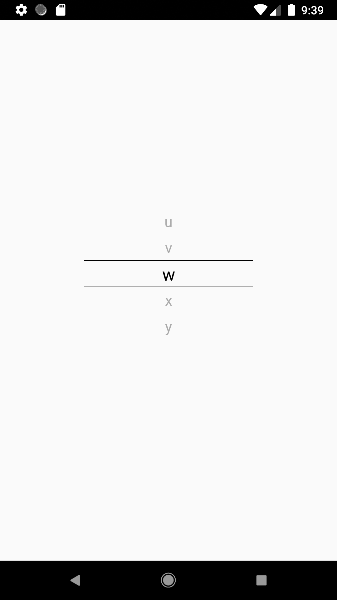

# react-native-pick-android

## Getting started

`$ npm install react-native-pick-android --save`

### Mostly automatic installation

`$ react-native link react-native-pick-android`

### Manual installation


#### Android

1. Open up `android/app/src/main/java/[...]/MainActivity.java`
  - Add `import com.reactlibrary.RNPickAndroidPackage;` to the imports at the top of the file
  - Add `new RNPickAndroidPackage()` to the list returned by the `getPackages()` method
2. Append the following lines to `android/settings.gradle`:
  	```
  	include ':react-native-pick-android'
  	project(':react-native-pick-android').projectDir = new File(rootProject.projectDir, 	'../node_modules/react-native-pick-android/android')
  	```
3. Insert the following lines inside the dependencies block in `android/app/build.gradle`:
  	```
      compile project(':react-native-pick-android')
  	```


## Usage
```javascript
import { Picker } from 'react-native-pick-android';

class Example extends React.Component {
  state = {
    data: 'b'
  }
  _onValueChange = (data) => {
    console.log(data);
    this.setState({ data })
  }
  render() {
    const data  = ["a", "b", "c"];
    return(
      <Picker
        initialData={this.state.data}
        data={data}
        onValueChange={this._onValueChange}
      />
    )
  }
}

```
  